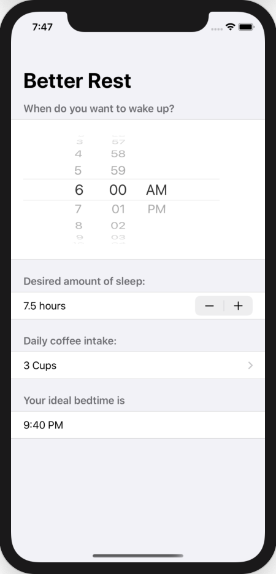
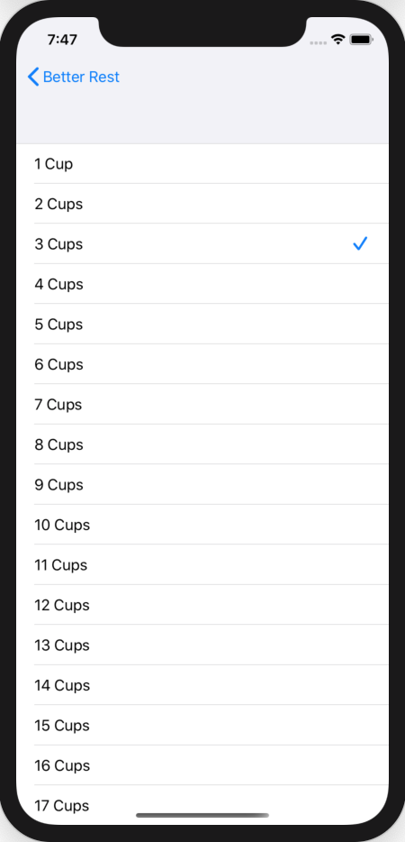

# 100 Days of SwiftUI Project 5

## Better Rest App

**App Description:**  Application to calculate ideal bed time, given desired wake up time, desired hours of sleep, and daily coffee intake.  Ideal bed time derived from Machine Learning module.

**Swift Features Used:**
Create ML, Navigation View, Form, Sections, Stepper, Picker.

**Screenshots:**

